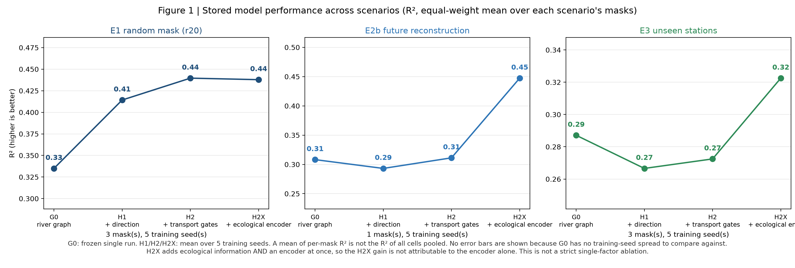
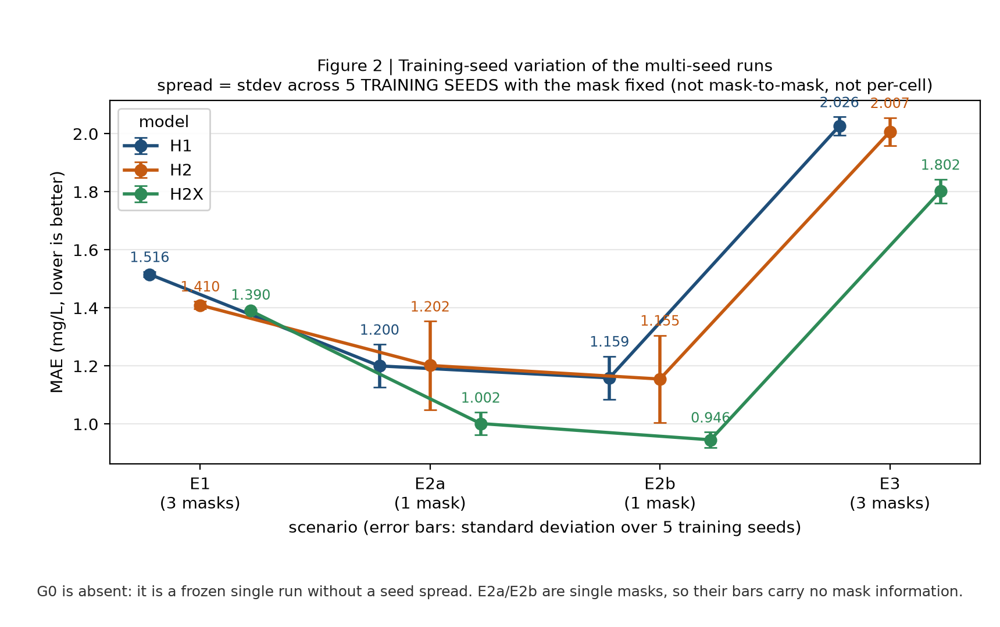

# river_graph

**Topology-aware Graph Neural Networks for Reconstructing Sparse Dissolved
Organic Carbon Observations in the Mississippi River Basin**

## Scientific question

USGS DOC monitoring is sparse and irregular: in the Mississippi River Basin,
11,948 stations have at least one DOC sample, but only ~570 have a usable
record, and only 8.9% of (station, month) cells are observed. Can the river
network itself — connectivity, flow direction, transport physics, and the
ecological identity of each reach — help reconstruct what was never measured?

## Key idea

```
sparse DOC observations
      +  river topology (NLDI / NHDPlus)
      +  ecological context (StreamCat catchment attributes)
      ↓
directed, transport-gated GNN with an ecological context encoder
```

## Method evolution



G0 is a frozen single run; H1/H2/H2X are means over 5 training seeds. Each
scenario value is the equal-weight mean over that scenario's masks (E1 and E3
average 3 masks, E2a/E2b are single masks). A mean of per-mask R² is not the R²
of all cells pooled, and no error bars are drawn because G0 has no
training-seed spread to compare against. **This is not a strict single-factor
ablation**: H2X adds ecological information *and* an encoder at once, and there
is no same-protocol H2E control, so the H2X gain cannot be attributed to the
encoder alone. Source data:
`experiments/figures/figure1_method_evolution_data_source_data.csv`.

| stage | model | adds | what the stored results show |
|---|---|---|---|
| G0 | plain GCN | river graph as undirected edges | topology > random graph > no graph on E1 (historical single run) |
| H1 | directed relational GCN | separate upstream/downstream channels | direction helps on E1; on E2a/E2b it gives no reliable gain |
| H2 | transport-gated GCN | edge physics gates (hop distance, reach length, drainage area, slope, stream order) | clearly better than H1 on E1; **no reliable gain on E2a/E2b** |
| H2E | + ecological context | StreamCat: land cover, climate normals, soil organic matter, elevation, baseflow | historical run only; improved E3 |
| **H2X** | **+ ecological context encoder** | MLP embedding of the context block | **best mean MAE of the 8 key masks**; E2b R² 0.447; **does not improve E1 R²** |

## Benchmark

- **Graph**: 571 stations, 562 directed edges (upstream → downstream) built via
  NLDI over NHDPlus.
- **Labels**: monthly-mean DOC (USGS pcode 00681), 1972-04 to 2026-07;
  33,048 observed (station, month) cells (8.88% of the 571 × 652 grid),
  spread over 570 stations.
- **Experiments**: E1 random masks (20/40/60% × 3 seeds), E2a strict future
  forecasting, E2b future reconstruction with a running network (80/20 cell
  split), E3 spatial extrapolation (20% of stations held out × 3 seeds).
- **Baselines**: station mean, Euclidean kriging, random forest, MLP.

### Historical reference table (frozen single-run batch)

MAE in mg/L, lower is better. E1 entries average the 3 seed masks; E2a/E2b are
single masks; E3 averages 3 masks. Source:
`experiments/frozen_results/benchmark.csv` (154 rows, 11 models × 14 masks).

| model | E1 r20 | E1 r40 | E1 r60 | E2a | E2b | E3 |
|---|---|---|---|---|---|---|
| station mean | 1.46 | 1.48 | 1.48 | 1.14 | 1.12 | 2.59 |
| kriging | 2.15 | 2.17 | 2.22 | n/a¹ | 1.51 | 2.05 |
| random forest | 1.42 | 1.44 | 1.46 | 1.11 | 1.11 | 2.07 |
| MLP | 1.87 | 1.86 | 1.88 | 1.31 | 1.29 | 2.02 |
| G0 river GCN | 1.67 | 1.72 | 1.76 | 1.17 | 1.13 | 1.92 |
| H1 directed | 1.51 | 1.55 | 1.63 | 1.24 | 1.18 | 2.03 |
| H2 transport | 1.41 | 1.46 | 1.52 | 1.08 | 1.02 | 2.01 |
| H2E transport | 1.40 | 1.44 | 1.50 | 1.24 | 1.14 | 1.79 |
| H2X (ours) | 1.41 | 1.41 | 1.52 | 0.96 | 1.06 | 1.77 |

¹ Kriging predicts nothing on `e2a_strict` (no same-month observations to
interpolate), so its committed row has n = 0 and NaN metrics. Its coverage is
not 100% in any mask (95.1%–99.9%), so its error values are **not** directly
comparable with full-coverage models; see
`experiments/analysis/predictions_report_20260912.md`.

This table mixes aggregation levels and is kept only as a historical reference.
r40/r60 come from this batch and are **not** part of the 5-seed refresh.

### Multi-seed refresh (current main result)

H1/H2/H2X refreshed with 5 training seeds × 8 key masks = 120 runs. Values are
the mean over the 5 training seeds; the ± is the **standard deviation across
training seeds** (not across masks, and not a per-cell uncertainty). Source:
`experiments/frozen_results/benchmark_multiseed.csv`,
`experiments/analysis/multiseed_report_20260912.md`.

| model | scenario | MAE (mg/L) | R² |
|---|---|---|---|
| H1 | E1 | 1.516 ± 0.009 | 0.414 ± 0.007 |
| H1 | E2a | 1.200 ± 0.074 | 0.268 ± 0.075 |
| H1 | E2b | 1.159 ± 0.075 | 0.293 ± 0.082 |
| H1 | E3 | 2.026 ± 0.032 | 0.267 ± 0.008 |
| H2 | E1 | 1.410 ± 0.014 | 0.440 ± 0.009 |
| H2 | E2a | 1.202 ± 0.152 | 0.281 ± 0.123 |
| H2 | E2b | 1.155 ± 0.151 | 0.311 ± 0.126 |
| H2 | E3 | 2.007 ± 0.049 | 0.272 ± 0.016 |
| **H2X** | E1 | **1.390 ± 0.005** | 0.438 ± 0.005 |
| **H2X** | E2a | **1.002 ± 0.039** | 0.410 ± 0.025 |
| **H2X** | E2b | **0.946 ± 0.026** | 0.447 ± 0.033 |
| **H2X** | E3 | **1.802 ± 0.041** | 0.323 ± 0.009 |

Same-seed, same-mask paired differences (40 pairs per comparison):

- **H2X − H2**: MAE improves in every E2a (5/5), E2b (5/5) and E3 (15/15) pair;
  on E1 only 11/15, and the E1 R² difference is **−0.0018** — H2X does **not**
  improve E1 R² (0.4396 vs 0.4378, both display as 0.44).
- **H2 − H1**: stable advantage only on E1 (15/15, ΔMAE −0.106). On E2a and E2b
  the paired mean is ≈0 (0.002 and −0.004) with a wide interval, and E3 is 9/15:
  there is **no reliable evidence that transport gating improves future
  reconstruction or spatial extrapolation**.
- H2 is markedly more seed-sensitive than H2X on E2a/E2b (MAE sd 0.15 vs 0.03–0.04),
  so single-seed conclusions about H2 there are unreliable.



## Diagnostics on the stored predictions

From `experiments/analysis/predictions_report_20260912.md` (historical batch,
83 files; plus 70 predictions recovered from Git):

- **Error is concentrated in the extreme tail.** Across all 154 stored
  predictions, the top 1% of cells by true DOC carry a **median 74% of the
  squared error**; on E3 seed43, 41 cells (1.0%) carry **95.6%** of it. RMSE-only
  comparisons are therefore dominated by a handful of cells, which is why
  log-space metrics are reported alongside.
- **HUC2 = 6** has the highest E3 cell-weighted MAE (3.55 vs 1.07–2.04 elsewhere).
- **Stations with no upstream monitoring neighbour in the graph** are worse in
  every scenario (H2X E1: 1.68 vs 1.18). The same ordering appears for the
  station-mean baseline, so this is a property of those stations, not a
  graph-specific defect. This wording is deliberately *not* "hydrological
  headwater": that would need a river-network attribute check.
- **ST (stream) stations are worse than other site types for every model,
  including the baseline** (H2X E1: 1.52 vs 0.85; station mean E1: 1.59 vs
  0.82). This is descriptive sensitivity inside a mixed-training model, **not**
  an ST-only validation.
- **Station 06438000** (HUC2 = 6) has valid high values (mean 63.1, max
  134.7 mg/L) that every model underestimates by an order of magnitude. The
  cause is **not** established; correlation with land use or sampling method is
  not evidence.
- **Station-level bootstrap intervals** are fixed-model sample-layer intervals
  and cannot substitute for the missing training-seed analysis.

## Reproducibility

```bash
uv sync --extra gnn --extra dev
python scripts/fetch_doc_inventory.py     # station inventory + catalog (NWIS)
python scripts/build_graph.py             # station graph via NLDI
python scripts/build_dataset.py           # dataset .pt (needs WQP pulls)
python scripts/fetch_streamcat.py         # ecological context (EPA)
python scripts/generate_masks.py          # benchmark masks
python scripts/run_freeze.py              # frozen predictions + benchmark.csv
```

Analysis entry points (no training):

```bash
python scripts/audit_artifacts.py --verify         # artifact identity + vs frozen table
python scripts/recover_historical_predictions.py --verify
python scripts/analyze_multiseed.py                # multi-seed tables
python scripts/analyze_predictions.py              # per-station / regional diagnostics
python scripts/figure1_evolution.py                # Figure 1 (+ source data, svg, pdf)
python scripts/figure2_multiseed_variation.py      # training-seed spread figure
python scripts/run_gnn.py --verify-predictions     # cached metrics without predictions
```

Training entry point (always stores predictions and a provenance sidecar):

```bash
python scripts/run_ladder.py --dry-run --arch directed --only e2b_partial
```

Data sources: USGS NWIS, Water Quality Portal, NLDI/NHDPlus, EPA StreamCat.
`data/` is gitignored; everything is re-derivable via the scripts above.

## Evidence status and known limits

Verified vs. unverified:

- All 85 predictions in `experiments/predictions/` and 70 recovered historical
  predictions were recomputed from the masks: 84 agree with the frozen table
  within float noise. **One file conflicts**
  (`G0_gcn_none__e1_r20_seed42.parquet`): commit `2b67bf0` overwrote it with a
  different model run and deleted 69 other predictions. It is excluded from
  analysis, and the frozen table stays authoritative. Details:
  `experiments/analysis/evidence_inventory_20260912.md`.
- Figures 2–4 in `docs/figures/imagegen_frozen_20260911/` are **illustrative**
  AI-generated images, not quantitative output, and must not be cited as
  numbers or as real maps. The ecological-group ablation figure is additionally
  affected by a known column-selection defect.
- `env_groups` column selection in `src/river_graph/models/gcn.py` is known to be
  wrong for subsets; the default full-feature H2X path is unaffected. Group
  rankings cannot support mechanism conclusions.

What this repository does **not** yet show:

- **No five-seed per-cell predictions.** H1/H2/H2X have metric-level multi-seed
  results only, so five-seed ensembling, five-seed residual maps and per-station
  intervals are not available.
- No r40/r60 multi-seed runs, no cross-basin evaluation, no ST-only core
  version, no same-protocol H2/H2E/H2X ablation, and no valid no-graph control
  under identical training.
- Predictions are stored only for **observed cells**; this is not a full
  571 × 652 missing-value imputation product.
- Kriging has incomplete coverage, and the 8 key masks share the same observed
  cells, so these are not independent samples: the tables are descriptive, with
  no p-values or significance claims.
- **No weight or environment lock.** There are config/dataset/mask hashes per
  prediction, but not a one-command replay that reproduces the same numbers.

## Layout

```
configs/             experiment configs
docs/                execution plan, storage notes, phase reports
experiments/         design docs, masks, frozen results, analysis, figures
scripts/             pipeline and analysis entry points
src/river_graph/     data / topology / models / baselines / experiments
tests/               unit tests
```
