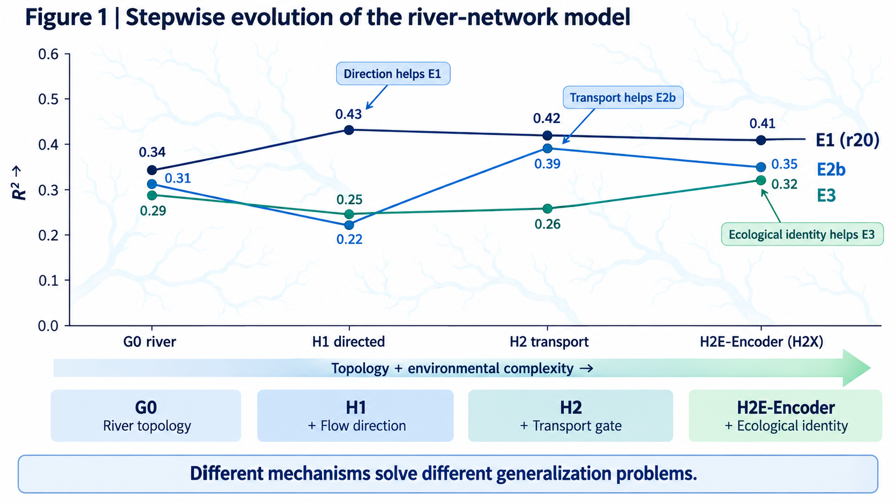
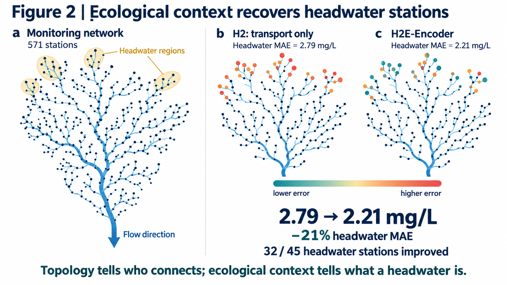
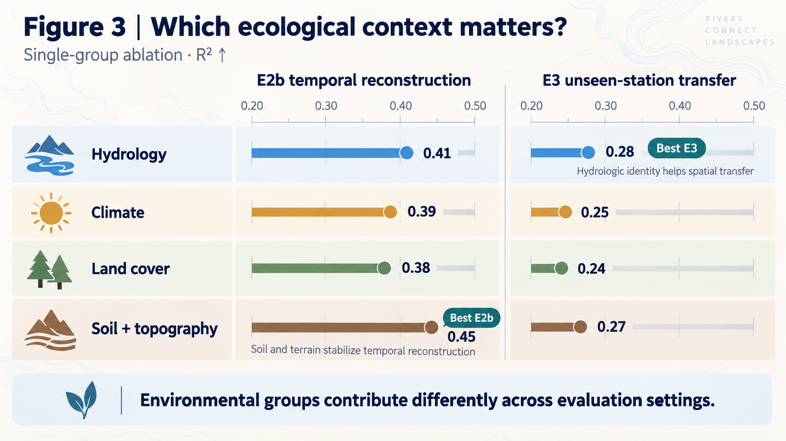
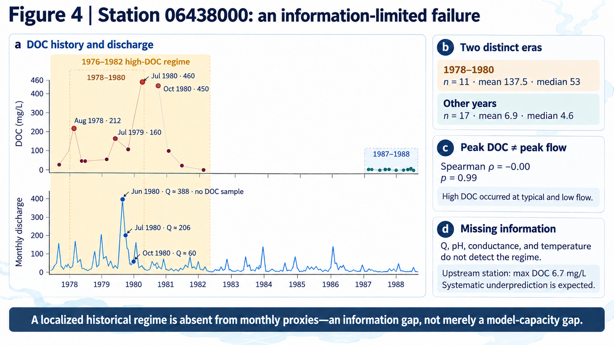

# river_graph

**Topology-aware Graph Neural Networks for Reconstructing Sparse Dissolved
Organic Carbon Observations in the Mississippi River Basin**

## Scientific question

USGS DOC monitoring is sparse and irregular: in the Mississippi River Basin,
11,948 stations have at least one DOC sample, but only ~570 have a usable
record, and only 8.9% of (station, month) cells are observed. Can the river
network itself — connectivity, flow direction, transport physics, and the
ecological identity of each reach — help reconstruct what was never measured?

## Key idea

```
sparse DOC observations
      +  river topology (NLDI / NHDPlus)
      +  ecological context (StreamCat catchment attributes)
      ↓
directed, transport-gated GNN with an ecological context encoder
```

## Method evolution (each step ablated on the same benchmark)



| stage | model | adds | finding |
|---|---|---|---|
| G0 | plain GCN | river graph as undirected edges | topology > random graph > no graph (E1) |
| H1 | directed relational GCN | separate upstream/downstream channels | direction helps temporal reconstruction; first model to beat RF on E2 |
| H2 | transport-gated GCN | edge physics gates (hop distance, reach length, drainage area, slope, stream order) | best on E2a/E2b; matches RF on E1 |
| H2E | + ecological context | StreamCat: land cover, climate normals, soil organic matter, elevation, baseflow | fixes spatial transfer (E3 R² 0.23 → 0.32) |
| **H2X** | **+ ecological context encoder** | MLP embedding of the context block | **best overall**: E2b MAE 0.96 / R² 0.47; E3 seed44 R² 0.53 |

## Benchmark

- **Graph**: 571 stations, 562 directed edges (upstream → downstream) built
  via NLDI over NHDPlus; largest connected component 407 nodes.
- **Labels**: monthly-mean DOC (USGS pcode 00681), 1972–2026, 33,048
  observed (station, month) cells.
- **Experiments**: E1 random masks (20/40/60% × 3 seeds), E2a strict future
  forecasting, E2b future reconstruction with a running network (80/20),
  E3 spatial extrapolation (20% stations held out × 3 seeds).
- **Baselines**: station mean, Euclidean kriging, random forest, MLP.
- All masks, predictions, and results are frozen under `experiments/`.

Headline results (MAE mg/L, lower is better; frozen benchmark):

| model | E1 r20 | E1 r40 | E1 r60 | E2a | E2b | E3 |
|---|---|---|---|---|---|---|
| station mean | 1.46 | 1.48 | 1.48 | 1.14 | 1.12 | 2.59 |
| kriging | 2.15 | 2.17 | 2.22 | n/a | 1.51 | 2.05 |
| random forest | 1.42 | 1.44 | 1.46 | 1.11 | 1.11 | 2.07 |
| MLP | 1.87 | 1.86 | 1.88 | 1.31 | 1.29 | 2.02 |
| G0 river GCN | 1.67 | 1.72 | 1.76 | 1.17 | 1.13 | 1.92 |
| H1 directed | 1.51 | 1.55 | 1.63 | 1.24 | 1.18 | 2.03 |
| H2 transport | 1.41 | 1.46 | 1.52 | 1.08 | 1.02 | 2.01 |
| **H2X (ours)** | **1.41** | **1.41** | 1.52 | **0.96** | 1.06 | **1.77** |

E3 values are 3-seed means. A multi-seed (×5) refresh with the stabilized
early-stopping rule is running; `experiments/frozen_results/benchmark.csv`
carries the authoritative per-mask table incl. log-space metrics.





## Notable analyses

- `experiments/analysis/` — E3 error attribution (headwater stations in the
  Missouri headwaters drive failures; ecological context recovers them,
  MAE 2.79 → 2.21) and the 06438000 high-DOC label audit (a 1970s-era
  localized regime episode, invisible to every available proxy).



## Reproducibility

```bash
uv sync --extra gnn --extra dev
python scripts/fetch_doc_inventory.py     # station inventory + catalog (NWIS)
python scripts/build_graph.py             # station graph via NLDI
python scripts/build_dataset.py           # dataset .pt (needs WQP pulls)
python scripts/fetch_streamcat.py         # ecological context (EPA)
python scripts/generate_masks.py          # benchmark masks
python scripts/run_freeze.py              # frozen predictions + benchmark.csv
```

Data sources: USGS NWIS, Water Quality Portal, NLDI/NHDPlus, EPA StreamCat.
`data/` is gitignored; everything is re-derivable via the scripts above.

## Layout

```
configs/             experiment configs
experiments/         design docs, masks, frozen results, analysis
scripts/             pipeline entry points
src/river_graph/     data / topology / models / baselines / experiments
tests/               unit tests (43)
```
