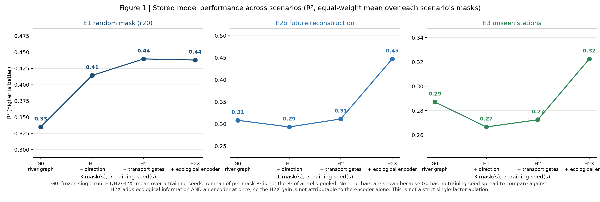
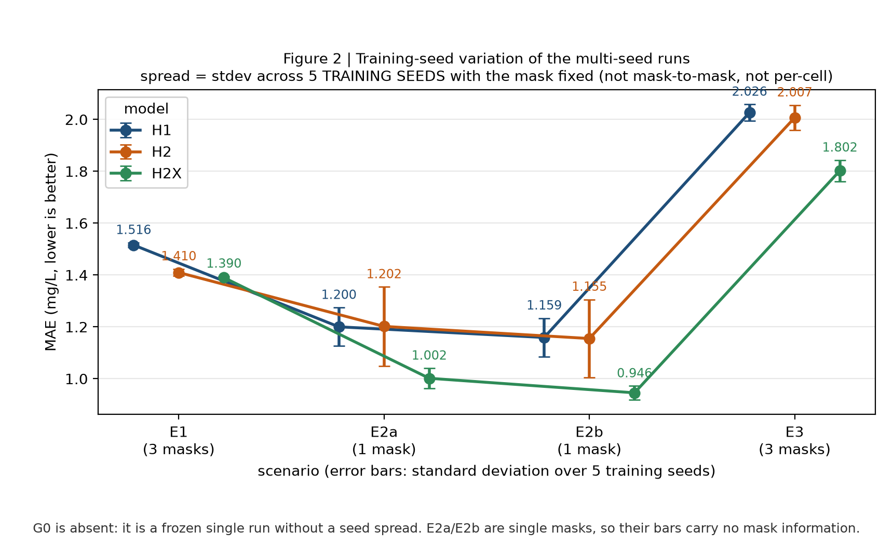

# river_graph

**Topology-aware Graph Neural Networks for Reconstructing Sparse Dissolved
Organic Carbon Observations in the Mississippi River Basin**

## River-form and DOC mechanism study

The [real-confluence follow-up](experiments/phase4_transfer/doc_river_confluence_response_v1/research_decision.md)
adds half-hour flow at all eleven mapped gauge sites and a separate five-junction
laboratory DOC/channel survey. Twelve eligible C2+C4→C7 spring windows show incoming
water-profile overlap of 0.71–0.88, with changing seasonal peak clocks at the same
geometry. At the five Tom's Creek junctions, two change DOC mixture-deviation sign
between seasons. Fall relative deepening has a descriptive rank correlation of
0.90 with DOC deviation, compared with 0.10 for widening. This supplies a local
geometry lead within one network; water timing is not substituted for carbon
timing, and the original three whole-network forms remain fixed.

The [hourly response comparison](experiments/phase4_transfer/doc_river_hourly_response_v1/research_decision.md)
separates later flow maxima from waveform broadening. All seven paired Turbolo
segments spanning at least 24 hours have downstream flow maxima 1–2 hours later,
but the two single-lobe cases have effectively unchanged widths. Optical DOC
requires a separate measurement audit: values above 600 FNU use flow/rainfall
regressions, and none of the seven long records supplies two complete DOC
half-height intervals outside that regime. All sampled DOC maxima also exceed
the source laboratory calibration range. The next field target is synchronized
branch–branch–outlet carbon-wave timing, connected to branch-path differences
and shared-trunk length; the original three morphology classes are retained.

The [flow-weighted mixing comparison](experiments/phase4_transfer/doc_river_flow_mixing_v1/research_decision.md)
now uses actual daily discharge on the matched laboratory dates. Eight windows
have complete flow, including seven repeated years at C7. In all seven C7
years, the calculated branch mixture has lower relative DOC variation than
the branch-CV average. Extra receiver smoothing is less consistent: outlet
absolute SD is smaller than the mixture in three of seven years. Measured
branches contribute roughly 64–77% of flow by window median, so this is a
partial-input comparison. The next question connects incoming signal synchrony
with independent branch paths and shared downstream length.

The [real-observation follow-up](experiments/phase4_transfer/doc_river_event_observations_v1/research_decision.md)
adds 5,057 laboratory DOC values at 16 SITES sites, daily discharge and actual
Krycklan stream geometry. Four monitored tributary–receiver configurations
yield 11 matched spring comparisons: receiving-stream relative DOC variation
is smaller in nine, with eight repeated years at C7. This supplies an observed
mixing lead, rather than a confirmed ranking of the three whole-network forms.
A separate public Turbolo optical-DOC case has 422 paired hourly records and
seven continuous blocks spanning at least 24 hours. Bilingual figures keep
laboratory points, optical estimates and actual river paths distinct. The next
step compares flow-weighted mixing and event timing with branch-path differences
and shared downstream length.

The [integrated structural portraits](experiments/phase4_transfer/doc_river_structure_profiles_v1/research_decision.md)
connect the three original real forms to arrival dispersion, shared paths and
actual storage positions across 297 station-network instances. The original
22 environment-matched elongated/broad pairs retain a clear path-dispersion
and identical-input pulse difference, while measured monthly DOC variation
does not establish the same class ranking. Bilingual real maps and evidence
figures distinguish measured structure, controlled responses and field DOC.

The [storage placement experiment](experiments/phase4_transfer/doc_river_storage_placement_v1/research_decision.md)
now compares earlier tributaries, later tributaries and shared downstream trunks
on 295 real confluences plus 59 monitored footprints. With fixed path means and
equal added variance, middle-pulse mean peak reductions are 4.60%, 7.04%, and
9.01%. Some branch placements raise the combined peak because increased
waveform overlap outweighs attenuation of the individual pulses. At equal
allocated storage time, mean reductions are about 5% across all three positions
and their paired differences are uncertain. This identifies component attenuation
and mixture overlap as separate structural controls on conservative DOC pulses.
Bilingual figures retain actual river geometry and explicit strength matching.

The [complete-network storage extension](experiments/phase4_transfer/doc_river_whole_storage_v1/research_decision.md)
now retains all three real river forms across 297 station-network instances
(295 receiving reaches). Under identical DOC forcing, elongated networks give
lower and longer pulses than broad networks; their original matched-pair
contrast persists after mapped storage and five-point reach-input refinement.
Moderate fixed-mean storage reduces the peak by more than 1% in 41 instances
and increases it by more than 1% in six. The response varies strongly within
each form: measured path arrangement and storage position matter in addition
to the class label. These are conservative geometry scenarios, not fitted
field residence times. The placement experiment above isolates storage position
along early/late tributary routes and shared downstream segments.

The [controlled branch/storage experiment](experiments/phase4_transfer/doc_river_storage_transport_v1/research_decision.md)
now separates unequal branch arrivals from common-trunk storage at the same
mean arrival time. Across 59 real monitored footprints, identical input pulses
show distinct peak and duration effects. For the middle-duration pulse,
receiver-equal branch peak reduction is 12.37%; allocating half the common
mean-time budget to a conservative storage response reduces peaks by a further
29.26% and expands central duration by 58.36%. All 1,416 geometric scenarios
preserve integrated anomaly. These are controlled responses, not measured DOC
removal or calibrated residence times. The extension above returns delay/storage
fingerprints to the complete real-network shape comparison.

The [sampling-resolution follow-up](experiments/phase4_transfer/doc_river_sampling_resolution_v1/research_decision.md)
checks original dates on 59 measured tributary pairs. Three-station samples
span a median four days; the median station samples every 28 days. Replacing
monthly means with date-aligned activities retains substantial asynchronous
tributary variability. The five connections with mapped common-trunk storage
have no common month with at least three sampling days at all three stations.
The controlled experiment above separates branch-arrival dispersion from
common-trunk storage broadening, keeping river structure as the explanatory
variable. Prior whole-network classes and model results remain available.

## Current DOC spatial-transfer development

The active model combines ecological/context prediction, a recurrent residual
expert and target-station support adaptation on the **357-station ST-only
cohort** (654 months, 22,571 observed station-months). The latest integration
uses source-station ecological residual memory and learns its mixing weight
separately for each support budget from source validation. Its newest performance
candidate adds within-month daily discharge descriptors to the existing neural
readout, while retaining the same forest, encoder, GRU and support basis.

Across three station partitions and three seeds, the daily-hydrology integrated
candidate has MAE **1.8035 mg/L at K=0** and **1.5650 mg/L at K=5**. At K5 it
improves **1.51%** over the matched monthly control and **0.94%** over the
preceding ecological-affine model (1.5799 mg/L); both paired station intervals
exclude zero. High-DOC Q90 error also falls by **1.40%** versus that reference.
K0 overall improvement remains uncertain. A subsequent
[availability-preserving fallback](experiments/phase4_transfer/doc_daily_hydro_fallback_v1/completion.md)
reuses the monthly expert when all numerical daily descriptors are invalid.
Integrated K0 MAE becomes **1.7944 mg/L** (0.51% lower than daily, interval
includes zero), but K5 worsens to **1.5714 mg/L**. Missing-input K0 behavior
improves while daily remains the main K5 candidate.

The completed [hydrologic-memory experiment](experiments/phase4_transfer/doc_daily_hydro_memory_v1/completion.md)
fits 27 recurrent models and 18 matched tree probes. Feeding daily information
through the causal 12-month GRU history yields integrated K0/K5 MAE
**1.7974/1.5676 mg/L**. History improves K0 by **0.58%** over the same-size
current-input projection (paired interval excludes zero), but its difference
from the retained daily-head-only model is uncertain, and K5 does not improve.
The integrated history model improves K0 by **2.79%** over the tree probe with
matched historical information; K5 neural–tree differences remain unresolved.
The daily-head model remains the main K5 candidate. K-shot support is
retrospective, and these partitions are development data.

A subsequent [station-support basis refresh](experiments/phase4_transfer/doc_daily_hydro_support_basis_v1/completion.md)
reads the selected current hidden states through the unchanged two-dimensional
adaptation projection. With three support readings, direct daily-head and
current-input MAE improve **1.45%/1.41%**, primarily in ordinary DOC and one
station partition. All refreshed K5 overall estimates worsen; K0/K1 are
unchanged. The main candidate remains the daily model with its existing
support basis. This led to a focused training experiment updating only the128
support-readout parameters while keeping the prediction trunk fixed.

That [episodic readout experiment](experiments/phase4_transfer/doc_daily_hydro_readout_v1/completion.md)
is now complete: nine fits learn only the 64×2 support map. Integrated K5 MAE
is **1.5710 mg/L**, versus 1.5725 for fixed refresh and **1.5650** for legacy.
The incremental learned-versus-fixed difference is uncertain; K3 worsens
slightly, and high-DOC recovery does not improve. Five fits select early
updates and four retain epoch0. The daily-head/legacy-support main candidate
is retained.

The [recurrent-clock comparison](experiments/phase4_transfer/doc_recurrent_clock_v1/completion.md)
then completes18 matched neural fits, retaining the old support basis.
Unseen-neutral and within-window discharge-age clocks yield integrated K5
MAE **1.5708/1.5690 mg/L**, versus **1.5650** for legacy. Both worsen Q90
errors; direct K5 gains are uncertain and do not survive ecological integration.
Neutral almost removes external state decay on validation windows, so its
effective capacity differs despite unchanged allocated parameters. The original
daily-head/legacy-support model remains the main candidate. The prepared
[next head experiment](experiments/phase4_transfer/doc_recurrent_clock_v1/next_iteration.md)
tests whether a small conditional mixture improves the remaining high-DOC
underprediction while retaining ordinary-DOC performance.

That [density-head comparison](experiments/phase4_transfer/doc_distribution_head_v1/completion.md)
has completed18 fits. The mixture yields integrated K0/K5 MAE
**1.7993/1.5620 mg/L**, small reductions of0.237%/0.190% versus the retained
point model. All twelve overall-MAE intervals cross zero; K5 improvement is
concentrated in one partition, and high-DOC underprediction remains. Keep
the point model as the main reference and the mixture as a challenger.
The [auxiliary-chemistry experiment](experiments/phase4_transfer/doc_auxiliary_chemistry_v1/completion.md)
has completed54 fits. Measured monthly pH and conductance lower matched-tree
K5 MAE from1.5776 to1.5379 mg/L (2.52%, all nine packages improve). The
linear neural branch does not reproduce this gain; integrated K5 MAE1.5713
is numerically worse than the retained1.5650. The
[nonlinear chemistry decoder](experiments/phase4_transfer/doc_chemistry_decoder_v1/completion.md)
has completed27 neural fits. Its chemistry-informed integrated K0 MAE is
**1.7649 mg/L**, down2.14% from1.8035, with a paired station interval excluding
zero and gains in all three partitions. Both ordinary and Q90 error improve.
K5 MAE1.5688 does not improve the retained1.5650; the chemical tree remains
stronger at K5. Keep the new decoder as a K0 chemistry-informed candidate and
the old model as the general reference. The completed
[chemical-state calibration](experiments/phase4_transfer/doc_chemistry_support_v1/completion.md)
adds two source-fitted chemical coordinates to the existing GRU support basis.
Its validation-selected integrated K0/1/3/5 MAE is
**1.7649/1.7386/1.5959/1.5569 mg/L**. At K3 it improves1.50% over the
general reference, with gains in all three partitions and a paired station
interval excluding zero. The K5 reduction is0.51%; all nine package estimates
improve, while its interval still crosses zero. K0/K1 remain exactly unchanged.
The chemical tree remains stronger at K3 and numerically stronger at K5.
Keep the new whole-curve procedure as the chemistry-informed neural candidate.
The follow-up [bounded residual-interpolation pilot](experiments/phase4_transfer/doc_chemical_kernel_v1/completion.md)
uses only source-validation stations. Its apparent fitted gains reverse under
conditional station-fold evaluation: integrated K3/K5 errors rise0.325%/0.067%.
Omit the extra kernel and retain the completed chemical-coordinate model for
new station-partition retraining. No outer target result is evaluated for this
negative pilot.
These experiments address reconstruction where auxiliary chemistry is known;
those measurements are available for only19.74% of genuinely DOC-missing cells.

See [latest results and reproduction](experiments/phase4_transfer/doc_daily_hydro_residual_v1/completion.md)
and [product roles](experiments/phase4_transfer/doc_daily_hydro_residual_v1/PRODUCTS.md).
The [preceding ecological integration](experiments/phase4_transfer/doc_ecological_transfer_v2/completion.md)
has K0/K5 MAE 1.8092/1.5799 mg/L, improving the prior interaction model's
zero-observation error by 1.42%; its small K5 difference was uncertain.
The sections below retain the earlier model evolution and historical benchmark.

The subsequent [regime-readout experiment](experiments/phase4_transfer/doc_regime_residual_v1/completion.md)
adds direct ecology and predicted-concentration conditioning to the existing
GRU residual. Its compact concentration head reduces Q90 error by 2.06% at K0
and 0.75% at K5 versus the prior interaction model, with a small ordinary-error
and false-high cost. The support-aware ecological model remains the strongest
overall model at that stage; the tail candidate is retained separately.

The [encoder-adaptation comparison](experiments/phase4_transfer/doc_encoder_residual_v1/completion.md)
then updates the existing final self layer and ecological encoder together with
the residual GRU. At a matched 30-epoch budget, K0 MAE falls from 1.8436 to
1.8299 mg/L (0.74%). A [matched duration extension](experiments/phase4_transfer/doc_encoder_budget_v1/completion.md)
shows that longer optimization also helps the frozen control. The updated
integrated model improves K0 Q90 error by 2.43% versus the current overall
model, but raises ordinary errors and false-high rates; the overall model
at that stage remains the reference. All fits stop before the new 60-epoch ceiling.

The [four-loss comparison](experiments/phase4_transfer/doc_selective_residual_v2/completion.md)
completes 72 fits across initial and extended common budgets. An ordinary-DOC
overprediction penalty lowers integrated K5 MAE to **1.5727 mg/L**, improving
1.01% over its matched tail-weighted control and 0.46% over the earlier overall
reference (the latter interval spans zero). K0 does not improve. Removing tail
emphasis reduces false-high rates while weakening high-DOC recovery, and equal
station weighting worsens K5. The previous overall model remained the reference;
the new support-adapted candidate and all negative comparisons are retained.

## Scientific question

USGS DOC monitoring is sparse and irregular: in the Mississippi River Basin,
11,948 stations have at least one DOC sample, but only ~570 have a usable
record, and only 8.9% of (station, month) cells are observed. Can the river
network itself — connectivity, flow direction, transport physics, and the
ecological identity of each reach — help reconstruct what was never measured?

## Key idea

```
sparse DOC observations
      +  river topology (NLDI / NHDPlus)
      +  ecological context (StreamCat catchment attributes)
      ↓
directed, transport-gated GNN with an ecological context encoder
```

## Method evolution



G0 is a frozen single run; H1/H2/H2X are means over 5 training seeds. Each
scenario value is the equal-weight mean over that scenario's masks (E1 and E3
average 3 masks, E2a/E2b are single masks). A mean of per-mask R² is not the R²
of all cells pooled, and no error bars are drawn because G0 has no
training-seed spread to compare against. **This is not a strict single-factor
ablation**: H2X adds ecological information *and* an encoder at once, and there
is no same-protocol H2E control, so the H2X gain cannot be attributed to the
encoder alone. Source data:
`experiments/figures/figure1_method_evolution_data_source_data.csv`.

| stage | model | adds | what the stored results show |
|---|---|---|---|
| G0 | plain GCN | river graph as undirected edges | topology > random graph > no graph on E1 (historical single run) |
| H1 | directed relational GCN | separate upstream/downstream channels | direction helps on E1; on E2a/E2b it gives no reliable gain |
| H2 | transport-gated GCN | edge physics gates (hop distance, reach length, drainage area, slope, stream order) | clearly better than H1 on E1; **no reliable gain on E2a/E2b** |
| H2E | + ecological context | StreamCat: land cover, climate normals, soil organic matter, elevation, baseflow | historical run only; improved E3 |
| **H2X** | **+ ecological context encoder** | MLP embedding of the context block | **best mean MAE of the 8 key masks**; E2b R² 0.447; **does not improve E1 R²** |

## Benchmark

- **Graph**: 571 stations, 562 directed edges (upstream → downstream) built via
  NLDI over NHDPlus.
- **Labels**: monthly-mean DOC (USGS pcode 00681), 1972-04 to 2026-07;
  33,048 observed (station, month) cells (8.88% of the 571 × 652 grid),
  spread over 570 stations.
- **Experiments**: E1 random masks (20/40/60% × 3 seeds), E2a strict future
  forecasting, E2b future reconstruction with a running network (80/20 cell
  split), E3 spatial extrapolation (20% of stations held out × 3 seeds).
- **Baselines**: station mean, Euclidean kriging, random forest, MLP.

### Historical reference table (frozen single-run batch)

MAE in mg/L, lower is better. E1 entries average the 3 seed masks; E2a/E2b are
single masks; E3 averages 3 masks. Source:
`experiments/frozen_results/benchmark.csv` (154 rows, 11 models × 14 masks).

| model | E1 r20 | E1 r40 | E1 r60 | E2a | E2b | E3 |
|---|---|---|---|---|---|---|
| station mean | 1.46 | 1.48 | 1.48 | 1.14 | 1.12 | 2.59 |
| kriging | 2.15 | 2.17 | 2.22 | n/a¹ | 1.51 | 2.05 |
| random forest | 1.42 | 1.44 | 1.46 | 1.11 | 1.11 | 2.07 |
| MLP | 1.87 | 1.86 | 1.88 | 1.31 | 1.29 | 2.02 |
| G0 river GCN | 1.67 | 1.72 | 1.76 | 1.17 | 1.13 | 1.92 |
| H1 directed | 1.51 | 1.55 | 1.63 | 1.24 | 1.18 | 2.03 |
| H2 transport | 1.41 | 1.46 | 1.52 | 1.08 | 1.02 | 2.01 |
| H2E transport | 1.40 | 1.44 | 1.50 | 1.24 | 1.14 | 1.79 |
| H2X (ours) | 1.41 | 1.41 | 1.52 | 0.96 | 1.06 | 1.77 |

¹ Kriging predicts nothing on `e2a_strict` (no same-month observations to
interpolate), so its committed row has n = 0 and NaN metrics. Its coverage is
not 100% in any mask (95.1%–99.9%), so its error values are **not** directly
comparable with full-coverage models; see
`experiments/analysis/predictions_report_20260912.md`.

This table mixes aggregation levels and is kept only as a historical reference.
r40/r60 come from this batch and are **not** part of the 5-seed refresh.

### Historical multi-seed refresh

H1/H2/H2X refreshed with 5 training seeds × 8 key masks = 120 runs. Values are
the mean over the 5 training seeds; the ± is the **standard deviation across
training seeds** (not across masks, and not a per-cell uncertainty). Source:
`experiments/frozen_results/benchmark_multiseed.csv`,
`experiments/analysis/multiseed_report_20260912.md`.

| model | scenario | MAE (mg/L) | R² |
|---|---|---|---|
| H1 | E1 | 1.516 ± 0.009 | 0.414 ± 0.007 |
| H1 | E2a | 1.200 ± 0.074 | 0.268 ± 0.075 |
| H1 | E2b | 1.159 ± 0.075 | 0.293 ± 0.082 |
| H1 | E3 | 2.026 ± 0.032 | 0.267 ± 0.008 |
| H2 | E1 | 1.410 ± 0.014 | 0.440 ± 0.009 |
| H2 | E2a | 1.202 ± 0.152 | 0.281 ± 0.123 |
| H2 | E2b | 1.155 ± 0.151 | 0.311 ± 0.126 |
| H2 | E3 | 2.007 ± 0.049 | 0.272 ± 0.016 |
| **H2X** | E1 | **1.390 ± 0.005** | 0.438 ± 0.005 |
| **H2X** | E2a | **1.002 ± 0.039** | 0.410 ± 0.025 |
| **H2X** | E2b | **0.946 ± 0.026** | 0.447 ± 0.033 |
| **H2X** | E3 | **1.802 ± 0.041** | 0.323 ± 0.009 |

Same-seed, same-mask paired differences (40 pairs per comparison):

- **H2X − H2**: MAE improves in every E2a (5/5), E2b (5/5) and E3 (15/15) pair;
  on E1 only 11/15, and the E1 R² difference is **−0.0018** — H2X does **not**
  improve E1 R² (0.4396 vs 0.4378, both display as 0.44).
- **H2 − H1**: stable advantage only on E1 (15/15, ΔMAE −0.106). On E2a and E2b
  the paired mean is ≈0 (0.002 and −0.004) with a wide interval, and E3 is 9/15:
  there is **no reliable evidence that transport gating improves future
  reconstruction or spatial extrapolation**.
- H2 is markedly more seed-sensitive than H2X on E2a/E2b (MAE sd 0.15 vs 0.03–0.04),
  so single-seed conclusions about H2 there are unreliable.



## Diagnostics on the stored predictions

From `experiments/analysis/predictions_report_20260912.md` (historical batch,
83 files; plus 70 predictions recovered from Git):

- **Error is concentrated in the extreme tail.** Across all 154 stored
  predictions, the top 1% of cells by true DOC carry a **median 74% of the
  squared error**; on E3 seed43, 41 cells (1.0%) carry **95.6%** of it. RMSE-only
  comparisons are therefore dominated by a handful of cells, which is why
  log-space metrics are reported alongside.
- **HUC2 = 10 (Missouri)** has the highest E3 cell-weighted MAE (2.66 vs 1.08–1.58
  elsewhere), on 106 stations and 4,379 cells. HUC2 is read from the authoritative
  `huc_cd` in `data/processed/graph_nodes.csv`, never inferred from station-id
  prefixes (a USGS id is not a HUC code: station 06438000 is HUC2 10, not 06).
- **HUC2 = 8 (Lower Mississippi) reverses the ranking**: on its 4 test stations
  the station-mean baseline is best (0.61) and H2X worst (2.18). The sample is
  small (654 cells, 4 stations), so this supports no conclusion — but it shows the
  H2X advantage is **not uniform across regions**, and the overall mean should not
  be read as holding everywhere.
- **Stations with no upstream monitoring neighbour in the graph** are worse in
  every scenario (H2X E1: 1.68 vs 1.18). The same ordering appears for the
  station-mean baseline, so this is a property of those stations, not a
  graph-specific defect. This wording is deliberately *not* "hydrological
  headwater": that would need a river-network attribute check.
- **ST (stream) stations are worse than other site types for every model,
  including the baseline** (H2X E1: 1.52 vs 0.85; station mean E1: 1.59 vs
  0.82). This is descriptive sensitivity inside a mixed-training model, **not**
  an ST-only validation.
- **Station 06438000** (HUC2 10, Belle Fourche River, SD) has valid extreme
  values: 28 observed months from 1978-03 to 1988-09, median 6.75 mg/L, mean
  58.2 mg/L and a maximum of **460 mg/L** (2 months above 400). Every model
  underestimates those months by an order of magnitude. The cause is **not**
  established; correlation with land use or sampling method is not evidence.
- **Station-clustered bootstrap intervals** (a station is drawn with all of its
  rows, so the unit is the station rather than a station-and-split combination)
  are fixed-model sample-layer intervals and cannot substitute for the missing
  training-seed analysis.

## Reproducibility

```bash
uv sync --extra gnn --extra dev
python scripts/fetch_doc_inventory.py     # station inventory + catalog (NWIS)
python scripts/build_graph.py             # station graph via NLDI
python scripts/build_dataset.py           # dataset .pt (needs WQP pulls)
python scripts/fetch_streamcat.py         # ecological context (EPA)
python scripts/generate_masks.py          # benchmark masks
python scripts/run_freeze.py              # frozen predictions + benchmark.csv
```

Analysis entry points (no training):

```bash
python scripts/audit_artifacts.py --verify         # artifact identity + vs frozen table
python scripts/recover_historical_predictions.py --verify
python scripts/analyze_multiseed.py                # multi-seed tables
python scripts/analyze_predictions.py              # per-station / regional diagnostics
python scripts/figure1_evolution.py                # Figure 1 (+ source data, svg, pdf)
python scripts/figure2_multiseed_variation.py      # training-seed spread figure
python scripts/run_gnn.py --verify-predictions     # cached metrics without predictions
```

Training entry point (always stores predictions and a provenance sidecar):

```bash
python scripts/run_ladder.py --dry-run --arch directed --only e2b_partial
```

Data sources: USGS NWIS, Water Quality Portal, NLDI/NHDPlus, EPA StreamCat.
`data/` is gitignored; everything is re-derivable via the scripts above.

## Evidence status and known limits

Verified vs. unverified:

- All 85 predictions in `experiments/predictions/` and 70 recovered historical
  predictions were recomputed from the masks: 84 agree with the frozen table
  within float noise. **One file conflicts**
  (`G0_gcn_none__e1_r20_seed42.parquet`): commit `2b67bf0` overwrote it with a
  different model run and deleted 69 other predictions. It is excluded from
  analysis, and the frozen table stays authoritative. Details:
  `experiments/analysis/evidence_inventory_20260912.md`.
- Figures 2–4 in `docs/figures/imagegen_frozen_20260911/` are **illustrative**
  AI-generated images, not quantitative output, and must not be cited as
  numbers or as real maps. The ecological-group ablation figure was additionally
  affected by the `env_groups` column-selection defect (fixed 2026-09-23) and
  stays excluded from conclusions until re-run under the fix.
- `env_groups` column selection in `src/river_graph/models/gcn.py` was fixed on
  2026-09-23 (feature subsets were mis-indexed; the non-encoder path ignored
  the subset). Group rankings produced before the fix remain invalid and must
  be re-run before any claim.

What this repository does **not** yet show:

- **No five-seed per-cell predictions.** H1/H2/H2X have metric-level multi-seed
  results only, so five-seed ensembling, five-seed residual maps and per-station
  intervals are not available.
- No r40/r60 multi-seed runs, no cross-basin evaluation, no ST-only core
  version, no same-protocol H2/H2E/H2X ablation, and no valid no-graph control
  under identical training.
- Predictions are stored only for **observed cells**; this is not a full
  571 × 652 missing-value imputation product.
- Kriging has incomplete coverage, and the 8 key masks share the same observed
  cells, so these are not independent samples: the tables are descriptive, with
  no p-values or significance claims.
- **No weight or environment lock.** There are config/dataset/mask hashes per
  prediction, but not a one-command replay that reproduces the same numbers.

## Layout

```
configs/             experiment configs
docs/                execution plan, storage notes, phase reports
experiments/         design docs, masks, frozen results, analysis, figures
scripts/             pipeline and analysis entry points
src/river_graph/     data / topology / models / baselines / experiments
tests/               unit tests
```
