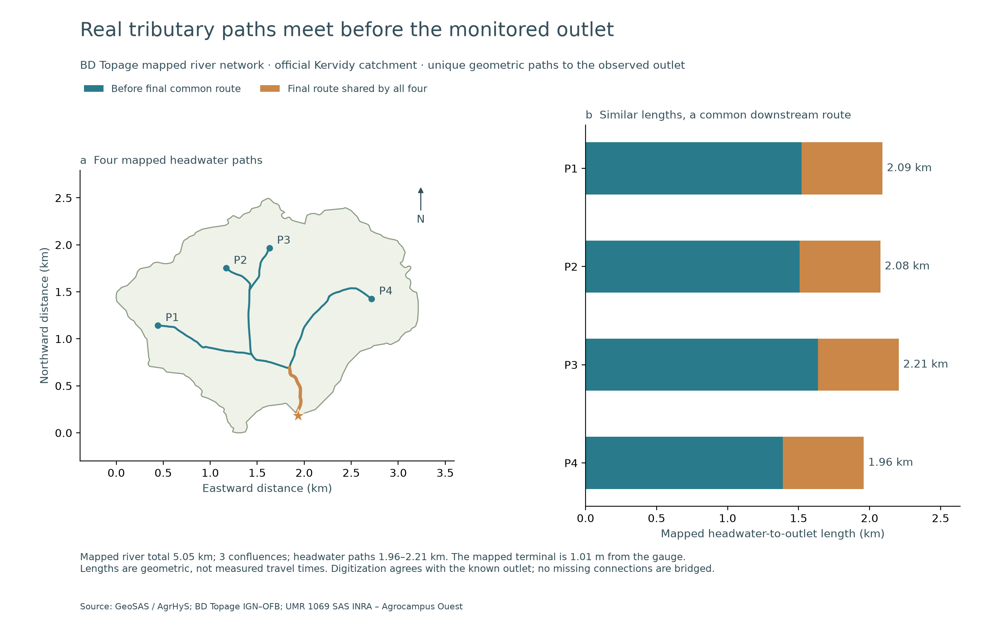
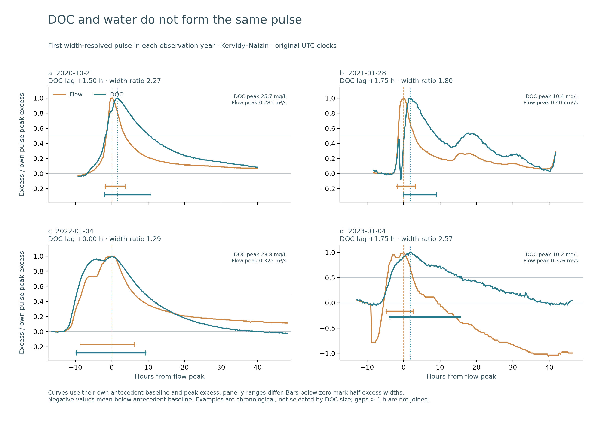
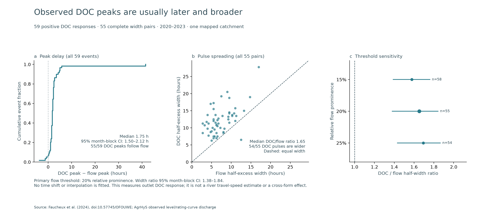

# Real river paths and observed DOC pulse spreading

Date: 2026-10-09

## Research result

In the mapped Kervidy–Naizin catchment, resolved outlet DOC peaks generally
follow outlet flow peaks, and DOC pulses last longer at half excess. Across
59 resolved positive DOC responses, the median peak lag is **1.75 hours**
(95% calendar-month-block bootstrap interval **1.500–2.125 hours**). Across
55 pairs with both widths observed, the median DOC/flow half-excess width
ratio is **1.652** (**1.379–1.842**). DOC follows flow in 55/59 events and is
wider in 54/55 pairs.

These are measurements of real outlet response in one catchment. They give
the morphology study an observable target: **how a network concentrates,
delays, or spreads a DOC pulse**. They do not yet estimate the difference
between elongated and tributary-rich river networks.

## From continuous records to comparable pulses

The event detector uses observed discharge alone, before inspecting DOC. It
uses 15-minute records without interpolation, a seven-day prominence window,
six-hour peak separation, prominence of at least 0.020 m³/s and 20% of peak
flow. The study plan was saved before applying this definition to the full
corrected-DOC period; the four annual response illustrations were already
known. This is exploratory event-method development.

The complete inventory retains 101 flow candidates. Of these, 86 have one
qualifying peak within their flow-return bounds. After flow-cap censoring,
dense joint records, antecedent availability and non-overlapping response
follow-up, 66 permit response assessment. Five have insufficient positive
DOC rise and two have their observed DOC maximum on a response boundary.
The remaining 59 permit peak timing; 55 have both half-excess widths.

DOC is followed until flow return plus 24 hours, shortened by the start of
the next candidate. A later large flow peak can have an envelope that begins
before a smaller peak. The first plotting review exposed seven such overlaps
in the primary inventory. The original code inadvertently ignored these
envelopes if their start preceded the smaller pulse's start. This was fixed
without changing any peak threshold. An overlapping follow-up cannot identify
an isolated response. The initial 66-response/59-width summary is retained
in `diagnostics/initial_pre_overlap_fix_summary.csv`; the final analysis uses
59 responses and 55 widths. A regression test covers the nested-envelope case.

Half-excess width is the elapsed time between observed below-half-excess
values bracketing the peak, relative to the median six-to-one-hour antecedent
baseline. Crossings across gaps over one hour are not inferred. A response can
contain smaller DOC fluctuations; the timing measurement concerns its dominant
observed DOC maximum, rather than proving a single source pulse.

## Sensitivity and checks

| Relative flow prominence | Positive DOC responses | Width pairs | Median lag (h) | Median width ratio |
|---|---:|---:|---:|---:|
| 15% | 63 | 58 | 1.75 | 1.578 |
| 20%, primary | 59 | 55 | 1.75 | 1.652 |
| 25% | 58 | 54 | 1.75 | 1.693 |

The later/broader response direction persists across these thresholds.
Uncertainty resamples calendar months, keeping events from the same month
together (5,000 draws, seed 42). There are 24 month blocks for primary peak
timing and 23 for paired widths. These intervals describe within-catchment
event variation; months are not independent river-network replicates.

Restricting DOC to exact flow-clock matches gives the same 59 responses,
55 widths and all headline summaries. No fitted clock shift is used. Raw and
corrected DOC occupy the same archived UTC row: the delivered concentration
correction is exactly `DOCcor = 0.9 × DOCraw + 0.34`, up to floating-point
precision, and hence does not itself move a peak in time. The authors document
UTC timestamps and laboratory calibration. This checks archive alignment,
not an independently certified synchronization of the two instruments.

The archive's modal usable cadence is 15 minutes, while the authors' README
describes a nominal 10-minute sensor setting during 2016–2023. We use delivered
timestamps, not the nominal setting, to measure elapsed time. The reported
corrected DOC versus laboratory RMSE is about 1 mg/L; the positive-rise rule
is an event-analysis definition rather than a statement of instrumental
accuracy. Optical calibration, hillslope release, channel mixing and changing
source contributions can all influence the observed response.

The first width-resolved event in each calendar year is independently checked
against raw source records in `diagnostics/source_record_spot_checks.csv`.
No examples are selected for their DOC amplitude or agreement with a desired
pattern. All annual distributions and all failed events remain available.

## Recovery is partly censored

Among the 59 resolved positive responses, 42 have an observed first return
to within 10% of their peak excess above baseline. For these **observed returns
only**, median time from DOC peak is **20.875 hours** (month-block interval
17.500–25.500 hours). Seventeen responses do not return before follow-up ends.
This is a conditional completed-return summary, not the median recovery time
of all events. No arbitrary 24-hour value is assigned to the censored cases.

## The actual river structure

The separately published BD Topage geometry forms an exactly connected tree
inside the official 4.890 km² catchment:

- 10 mapped reaches, 11 junction/end nodes and 3 confluences;
- 4 mapped headwater-to-outlet paths, **1.960–2.207 km** long;
- **569.3 m** of final downstream route shared by all four paths;
- mapped terminal **1.01 m** from the published DOC/flow gauge;
- total mapped river length inside the basin **5.048 km**.

Paths are rooted at the endpoint nearest the known gauge. No gaps are bridged.
All source coordinate directions agree with paths towards this outlet. This
also agrees with the [BD Topage production convention](https://www.sandre.eaufrance.fr/ftp/documents/fr/DocAdmin/ETH/1/sandre_administration_topage_1.pdf),
Annex 2, page 40, which normally digitizes in flow direction. The raw
`SensEcoule` numeral is preserved as `2`; the official numeric code list
could not be retrieved and is not decoded by assumption. Rooted lengths are
unique geometric paths, not hydraulic velocities or measured travel times.

The earlier field-map export gave 4.495 km inside the same boundary and had
no usable direction fields and disconnected endpoints. BD Topage is a
different published river layer; its connected 5.048 km total does not replace
or retroactively change the earlier map. The geometry resolution and mapped
headwater population must accompany any later network comparison.

## What this says about morphology

The map makes a concrete structural question possible: several tributary paths
meet, then all pass through a shared downstream corridor. Their mapped total
lengths are fairly similar (path-length coefficient of variation 4.2%). Yet
the observed DOC response is substantially broader than the flow response.
This motivates distinguishing **arrival-time differences between tributaries**
from **spreading along their common downstream route**.

We cannot assign the observed 1.65 width ratio to one of these mechanisms from
outlet data alone. Equal geometric lengths do not imply equal velocities or
simultaneous DOC release; sources also occur along reaches and on hillslopes,
not just at the four mapped endpoints. In particular, the 1.75-hour outlet
DOC–flow lag must not be divided into path length to estimate river velocity.

The next comparative question stays centered on river structure:

> Do networks with more unequal tributary-to-outlet paths, or longer shared
> downstream corridors, show systematically different DOC peak delays and
> pulse spreading under comparable flow events?

Use these event measurements on additional independent mapped catchments.
Retain length distributions and shared-route geometry as primary explanatory
descriptors, with elongated/tributary-rich labels as readable summaries. Match
or account for catchment size, event flow rise and antecedent conditions. Do
not replace the structural question with a ranking of land-cover sources.
Within one catchment, repeated events characterize response variability but
cannot identify a static morphology effect. Upstream DOC/flow observations,
when available, are the direct way to separate arrival staggering from shared
route spreading. Existing controlled four-case experiments remain process
experiments and are not relabeled as field causal estimates.

## Deliverables and reproduction

The analysis, English/Chinese figures, complete candidate inventories,
clock-matching sensitivity and connected path geometries are saved here.
Run, through the project's uv environment:

```bash
uv run python scripts/analyze_doc_river_kervidy_paths_v1.py
uv run python scripts/analyze_doc_river_kervidy_pulses_v1.py
uv run python scripts/plot_doc_river_kervidy_pulses_v1.py
uv run python scripts/plot_doc_river_kervidy_pulses_v1.py --chinese
```

Raw data remain in the existing ignored raw-data directories. The additional
Topage download URL and geometry checksum are in `topage_sources.json`.
This work performs no model training and does not change Phase 0–3 results,
the stopped training automation, or the existing manuscript's model claims.

Validation on this version: **1,379 pytest tests passed, 2 skipped**, Ruff passed,
and the historical artifact audit exited 0. Its historical limitations remain:
83 parquet-only verifications, one documented excluded G0 conflict, one
zero-coverage artifact and 85 older predictions without sidecars. That audit
is not a claim that those historical identities became complete. All six
English/Chinese PNG figures were visually inspected; nested event follow-up,
clipped normalized traces and a map-legend placement were corrected before
release.

### Figures






